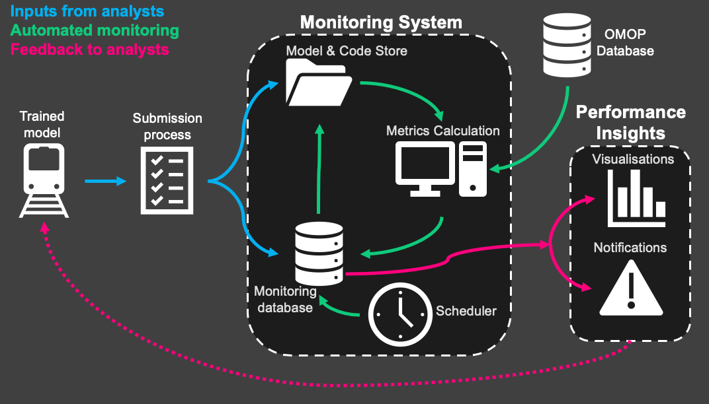
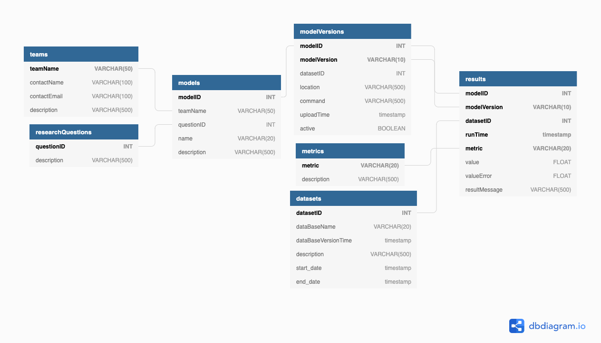

# DECOVID Model Monitoring Overview
_5th June_

# Components

## 1. Submission Process

### Analysts need to create and submit:
- Metrics script:
  - Inputs: Start date, end date, database to connect to.
  - Outputs: Metrics value in a known format, e.g. a JSON/CSV including the metric
  names, values, and optionally the error/confidence interval on those values.
- Environment spec:
  - Language version, package versions etc. We know options for Python (requirements.txt,
    conda envs etc.), less sure about R but have found e.g. the
    [renv](https://rstudio.github.io/renv/articles/renv.html) package.
- Training values for metrics.
  - One file in the same format as produced by the metrics script (key value pairs
    in JSON/CSV format).
  - Another file specifying exactly which data records were used to calculate those
  values.
- Metadata: Team details, research question, model name and version etc.

**Outstanding questions:**
- How should the submission (code + artefacts, metadata, metric values, environment)
work?
- How to define a common way to create and activate the environment, and then run the scripts with configurable parameters. Makefiles?

**Status:**
- We have made 3 dummy models on the [wine quality UCI dataset], 2 with python and 1 with R, each using completely different packages, types of model etc. We plan to use these to test the feasibility of the above.
  - Next: Dummy models on OMOP data.

### Reproducibility Check

Before adding the model to the monitoring system we want to validate that:

1. We can create and activate the environment.
2. We can successfully run the metrics calculation script.
3. The values of the metrics match the reference values in the submitted file (if
  run on the same data).

Parallels with Louise & Eric's work and repro-catalogue.

Ideally this would also be
an automated process that runs as soon as a model is submitted, and provides automated feedback to the analysts (and us) in case of issues.

**Status:**
- Haven't worked on this in the context of model monitoring yet.

## 2. Database & Model/Code Storage

Proposed database schema (see below) includes these tables:
* **Teams:** Contact point for submitted models.
* **Research Questions:** What each model is trying to answer.
* **Models:** Combination of team and research question.
* **Model Versions:** Each model can have multiple versions (multiple submissions).
Table will also specify where the model is stored, how to run it, and which dataset
it was trained on.
* **Datasets:** Combination of a database and a start and end date.
* **Metrics:** Name and descriptions of all metrics that are being logged.
* **Results:** Metric values for each model version on each dataset.

**Status:**
- Ed has defined the above schema in Postgres and is working on the first versions of scripts to add details and models to the database.

**Outstanding questions:**
- Where to store the code and pre-trained models?
- How to define, in the database, how to run the metric calculation script for each model?
- Will there be one monitoring system (database and all other components) per team,
or be sitting in a different secure research environment (with access to the data used by all teams)?

## 3. Automated Monitoring

On a schedule:
- Check there has been a data update since the last run.
- For all active model versions, run the metrics calculation script on the new data and log the results to the database.

**Outstanding questions:**
- Time/resources required to get predictions from potentially many models (probably will want some parallelisation at least).
- Cron or something more sophisticated?
- How much new data do we need for calculating new metric values to be worthwhile? Is this a consistent amount for each research question or model type?
- Do we only calculate on new data or for other data subsets too? E.g. all data, last month etc.
- Some details of how to query data only from a given time window maybe not entirely
clear yet - e.g. could we end up with multiple versions of the same row if we query
the temporal tables for data valid within the last month?

**Status:**
- Not working on this yet.

## 4. Visualisations and Feedback

**Visualisations:**
- Dashboard would be nice, but initially focus on some notebooks or formatted PDFs
and similar.
  - Can draw inspiration from Anna & Gordon's data stats work.
- Performance metrics over time for each model.
- Comparison of different models (or model versions) on the same research question.
  - though this will only be possible if they also use the same metrics.

**Performance Alerts:**
- I would like to have checks in place that determine whether performance has
dropped (or increased?) below a certain threshold of the training values. And if so
trigger some notification to the analyst team to investigate the cause of the problem.
  - Hope would be that the team then submits a new model version which fixes the performance.

**Status:**
- Not working on this yet.

**Outstanding questions:**
- Best way to share all this.

# Limitations and Plans for Future Versions

* We are considering predictive models. Many of the research questions may not be
predictive modelling questions. Are there other types of analysis that we should
be supporting for monitoring purposes and can they fit into the same framework?

* Calculation of the metrics is all defined by the analyst scripts. We have no
way of knowing whether there is a bug in the way the script is working, e.g. is
the script actually getting the correct data, are the metric function definitions
correct etc.
  - One idea for a future version is for analysts to submit a prediction script
  rather than a metrics calculation script. We can then feed the predictions into
  arbitrary metrics functions.

* The current model is based on calculating metrics on all data between a start
date and an end date. We may want to be monitoring metrics on different subgroups
within the data (e.g. gender, ethnicity etc.). This means being able to modify
the database queries the analysts are using.
